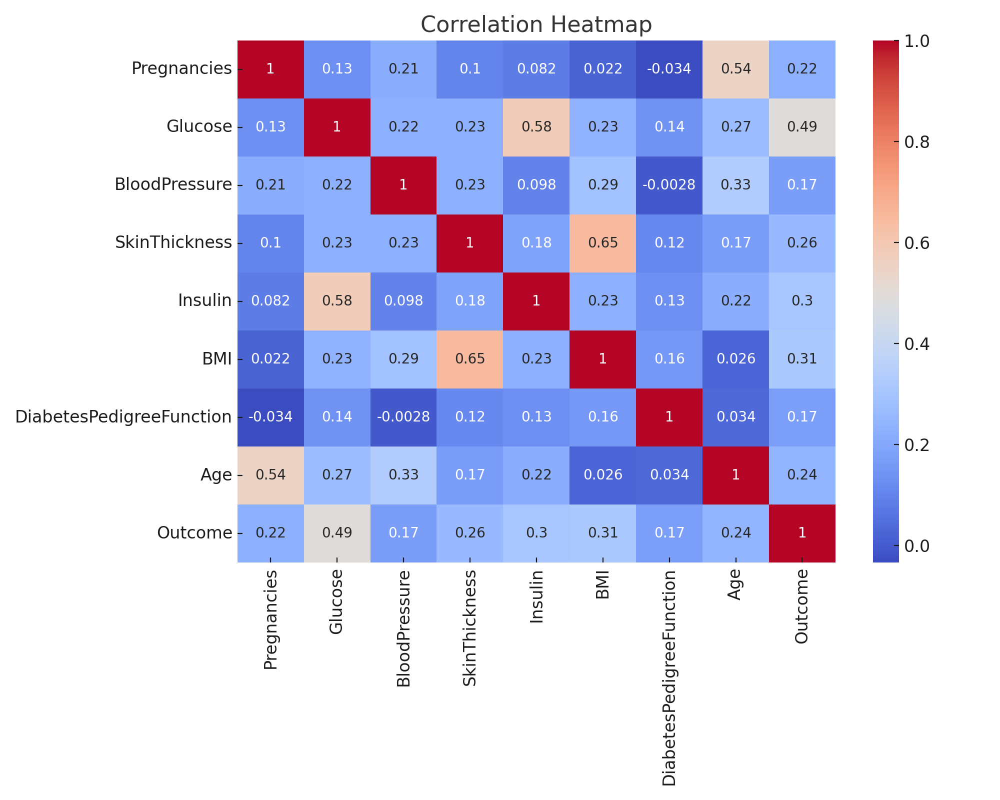
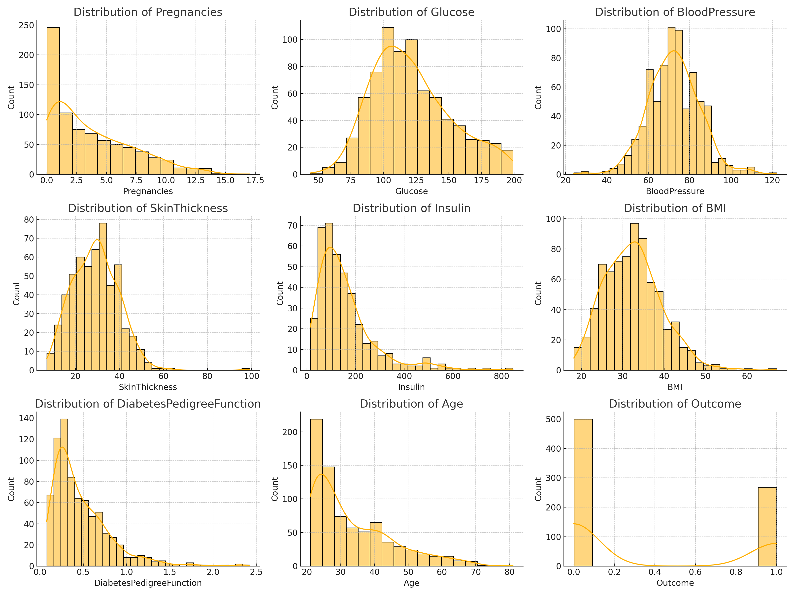

# Healthcare Predictive Analytics Project

This project uses machine learning to predict diabetes likelihood based on patient health metrics.

## Project Structure
- **Data Exploration:** Cleaning and analyzing the diabetes dataset.
- **Model Development:** Training multiple ML models and selecting the best.
- **MLOps:** Using MLflow for tracking and managing models.

## Exploratory Data Analysis (EDA)

### Correlation Heatmap

This heatmap shows the correlation between different health features, which helps identify multicollinearity and impactful predictors of diabetes.

### Feature Distributions

The histograms represent the distribution of key features like Age, BMI, HbA1c, and others. These help us understand data skewness and variance before modeling.

## Dataset Features
- Pregnancies, Glucose, BloodPressure, SkinThickness, Insulin, BMI, DiabetesPedigreeFunction, Age, Outcome

## Tech Stack
- Python, Pandas, Scikit-learn, MLflow

## Usage
1. Clone the repo
2. Run `diabetes_prediction.ipynb` for EDA and model training.

## Authors
- Adham Mohamed
- ALy Ahmed
- Abdelghani Adel
- Amr ALi
- Amr Mohamed
